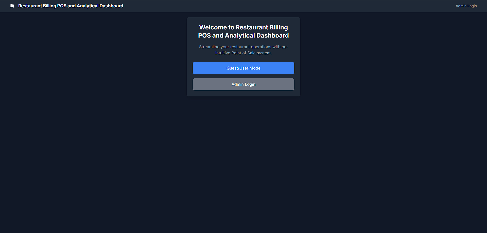
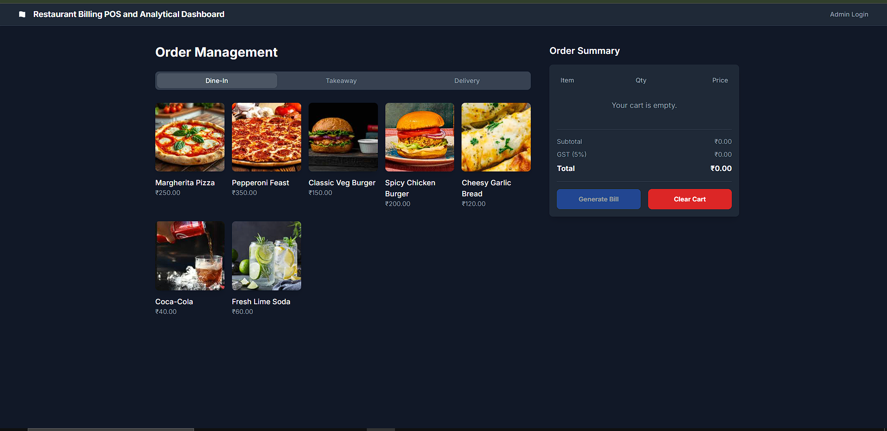
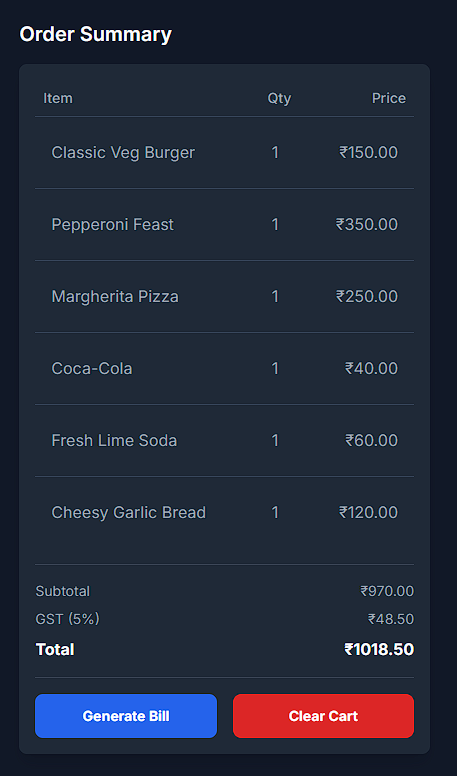
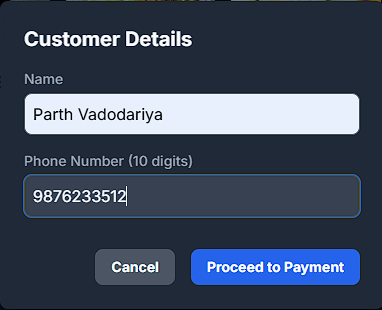
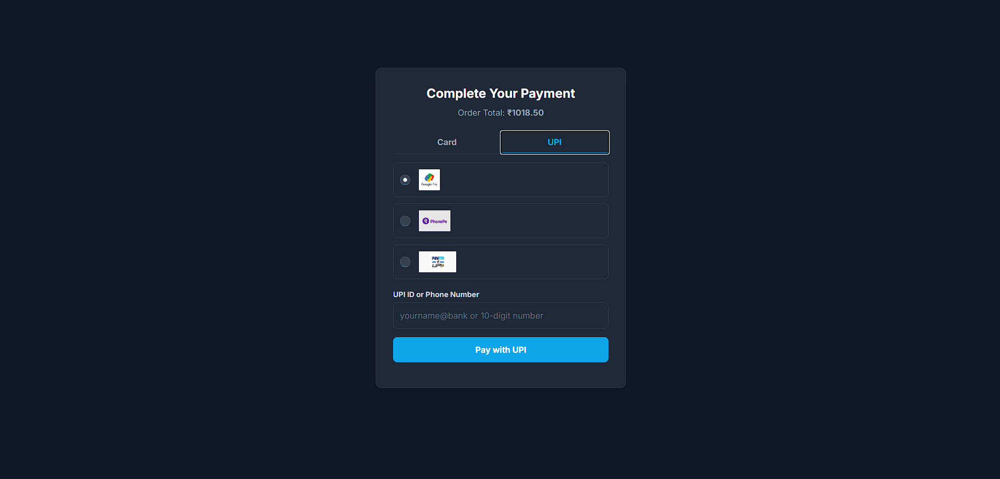
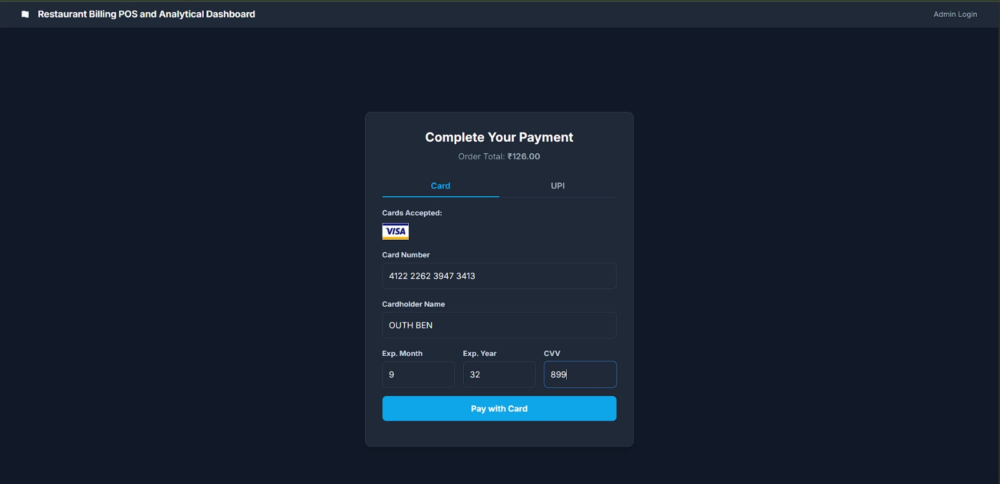
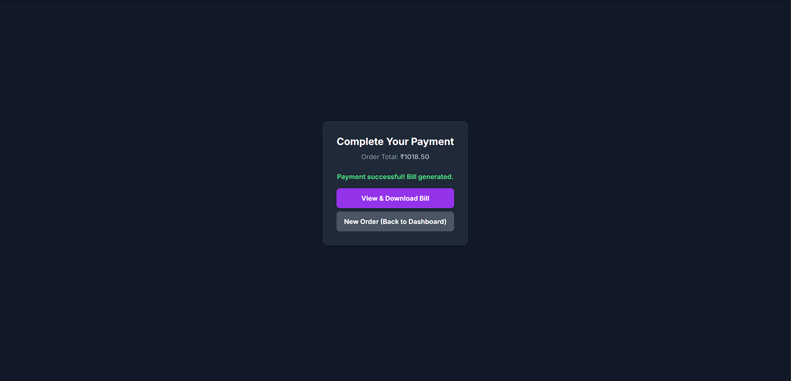

# note: 
- This project was completed on june to july 2025 for the acedemic sem 7  15 days of project timeline 

# 🍽 Restaurant POS & Analytics Dashboard

## 📌 Overview
This is a **full-stack restaurant Point of Sale (POS) system** built with **Flask** and **SQLite**, featuring:
- **Order Management**
- **Fake Payment Confirmation** for UPI, Card, and Cash (demo simulation only)
- **Invoice Generation**
- **Menu Management**
- **Professional Sales Analytics Dashboard** with interactive charts
- **CSV Exports** for sales reports

It is designed for **real-time order handling** in restaurants, cafés, or takeaway businesses, and includes a **secure admin panel** for menu and sales analytics.

---

## 🏗 Project Structure
The project is organized into several main directories and files:

- **`__pycache__/`** – Python cache files generated automatically.
- **`app/`** – Main application folder containing all core logic:
  - **`__init__.py`** – Initializes the Flask app and database.
  - **`models/`** – Database models, including `models.py`.
  - **`routes/`** – API and view routes, including:
    - `api_routes.py` – Core API endpoints (orders, analytics, payments)
    - `auth_routes.py` – Admin authentication endpoints
    - `view_routes.py` – Page rendering routes
  - **`services/`** – Background services like `initial_setup.py`.
  - **`static/`** – Static assets:
    - CSS files
    - Images
    - JavaScript files (`admin.js`, `analytics.js`, `auth.js`, `main.js`, `payment.js`)
  - **`templates/`** – HTML templates:
    - Auth pages (`auth/`)
    - Layout templates (`layouts/`)
    - Main pages (`admin_panel.html`, `analytics.html`, `dashboard.html`, `payment.html`)
  - **`utils/`** – Utility scripts like `pdf_generator.py` for invoice creation.
- **`instance/`** – Contains the SQLite database (`restaurant.db`), invoice PDFs, and CSV exports.
- **`config.py`** – Configuration settings for the Flask app.
- **`generate_monthly_data.py`** – Script for generating sample monthly sales data.
- **`requirements.txt`** – Python dependencies list.
- **`run.py`** – Application entry point for running the Flask server.

---

## 🚀 Features
### 1️⃣ Order Management
- Select menu items, quantities, and order type (**Dine-In**, **Takeaway**, **Delivery**)
- Automatically calculates GST and final total

### 2️⃣ Fake Payment Confirmation (Demo Mode)
- Supports **Cash**, **Card**, and **UPI**
- All payment confirmations are **simulated** (no real transactions)
- Payment details are stored for record-keeping

### 3️⃣ PDF Invoice Generation
- Generates a professional invoice after payment
- Stored in `/instance` for download

### 4️⃣ Admin Panel
- Secure login for admins
- Add, edit, delete, or bulk import/export menu items via CSV

### 5️⃣ Analytics Dashboard
- **KPIs:** Total Sales, Total Orders, Average Order Value
- **Charts:** Sales Trends, Order Type Distribution, Payment Methods, Top Selling Items
- **Full Items Table** with quantities sold
- **CSV Export** for sales reports

---

## ⚙ Installation & Setup
1. **Clone Repository**  
   git clone https://github.com/itsparth-victor/Restaurant-POS-Analytics-Dashboard.git 
   cd restaurant-pos  

2. **Create Virtual Environment**  
   python -m venv venv  
   source venv/bin/activate  # Mac/Linux  
   venv\Scripts\activate     # Windows  

3. **Install Dependencies**  
   pip install -r requirements.txt  

4. **Database Setup**  
   flask shell  
   from app import db  
   db.create_all()  

   *(Optional) Seed menu items:*  
   python app/services/initial_setup.py  

5. **Run Application**  
   python run.py  

Visit: **http://127.0.0.1:5000**

---

## 📂 API Endpoints
| Method | Endpoint                        | Description              |
| ------ | ------------------------------- | ------------------------ |
| GET    | `/menu`                         | Fetch menu items         |
| POST   | `/order`                        | Create new order         |
| POST   | `/order/<id>/pay`               | Process **fake payment** |
| GET    | `/analytics/dashboard`          | Fetch dashboard data     |
| GET    | `/analytics/items-sales/export` | Export sales CSV         |

---

## 🔒 Authentication
- Admin login required for Analytics and Admin Panel
- Uses `flask-login` for session handling
- Passwords hashed with `bcrypt`

---

## 📦 Tech Stack
**Backend:** Python, Flask, SQLAlchemy, SQLite  
**Frontend:** HTML, TailwindCSS, JavaScript, Chart.js  
**Auth:** Flask-Login, Bcrypt  
**Reports:** CSV, PDF (ReportLab)

---

## 📌 Future Enhancements
- Multi-branch support
- Real-time WebSocket updates
- Role-based permissions
- AI sales forecasting

---

## ⚠️ Demo Disclaimer
This project includes **fake payment confirmation** for UPI, Card, and Cash.  
No actual transactions occur, and no payment gateways are integrated.  
It is intended **only for demonstration and testing purposes**.

---

## 📸 Live Preview / Screenshots

**Main Page:**  

**Dashboard Page:**  

**Menu List cart:**  

**Get User Details:**  

**UPI Payment:**  

**Card Payment:**  

**Payment Success:**  

